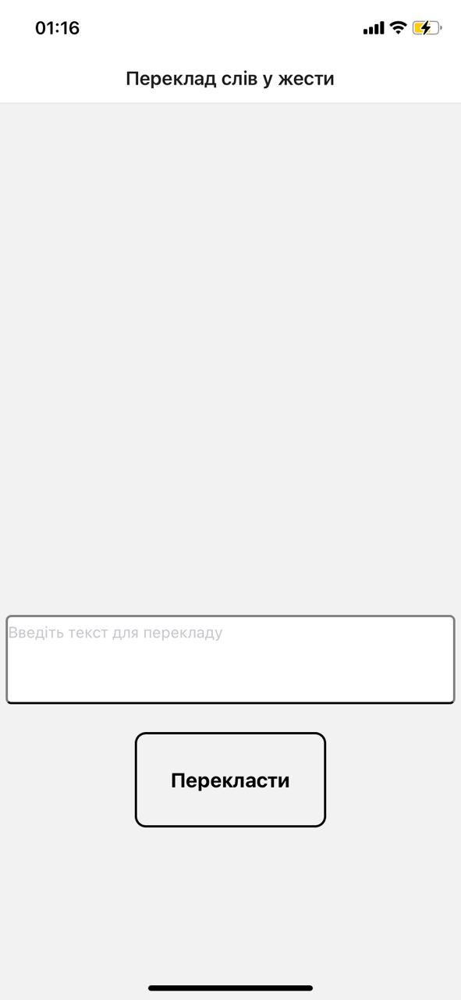
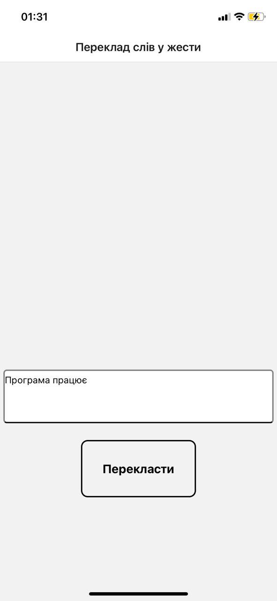
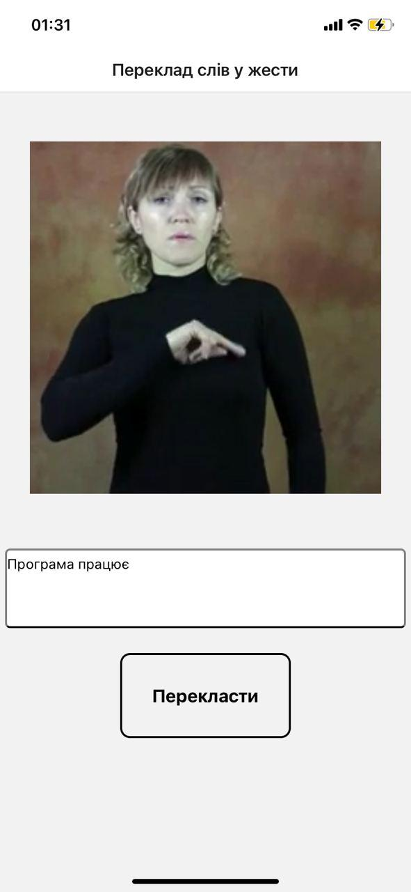
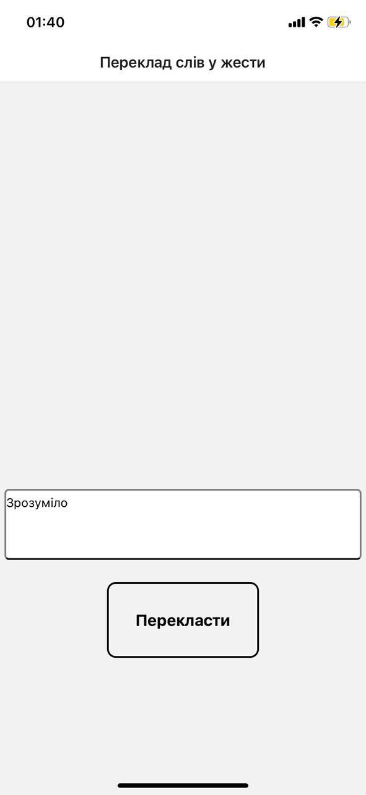

# Word to gesture translalor

***This version of app doesn't work properly***

## Instalation
to install app for Android you can use 
[link](https://drive.google.com/file/d/1lvKRSDbV323bu6bk3U-HPe_5cBGRqfDi/view?usp=sharing)

____

## To open on PC for developing

1.   Download project
2.   unzip
3.   cd Word-to-gesture-translator-master
4.   run npm install
5.   run expo start

____

## How to use application

### Trasnslate to video:

1.   Press on the field “Введіть текст для перекладу"

2.   Enter text to translation field

3.   Press button with text "Перекласти"

____

### Translate to text:

Gesture recognition and traslation is so difficult task, so translation will be doing as text input to field and reading it by second interlocutor

1.   Press on the field “Введіть текст для перекладу"

2.   Enter text to read for interlocutor

